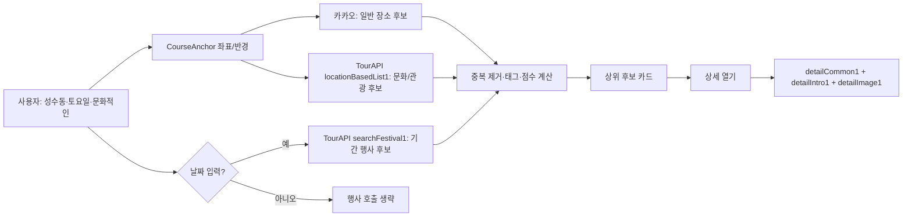

# 외부 API 조사 — 추가 후보

> 작성일: 2026-08-10  
> 범위: 기존에 정리한 **카카오 로컬 키워드 장소 검색**, **카카오 로컬 카테고리 장소 검색**을 제외한 API 후보입니다.  
> 원칙: 장소 후보 수집은 카카오 로컬을 기준으로 하고, 네이버는 리뷰 확인을 위한 **보조 정보/링크 탐색** 용도로 검증합니다.

## 우선순위 요약

| 우선순위 | API | 역할 | MVP 판단 |
| --- | --- | --- | --- |
| P0 | 카카오 주소·좌표 변환 | 사용자가 선택한 지역/주소를 지도 중심 좌표로 변환 | 도입 |
| P0 | 카카오맵 JavaScript SDK | 후보·완성 코스를 지도와 번호 마커로 표시 | 도입 |
| P0 | NAVER API HUB 지역 검색 | 카카오 장소와 네이버 검색 결과를 매칭해 `네이버에서 보기` 제공 | 소규모 매칭 실험 후 도입 |
| P1 | 한국관광공사 TourAPI | 관광지·문화시설·행사 등 활동 후보 보강 | 카카오 흐름 완성 후 도입 |
| P1 | 기상청 단기예보 | 날짜·시간대 날씨로 실내/야외 코스 보정 | Phase 3 |
| P1 | 카카오맵 경로 조회 | 확정된 장소 사이 시간·거리 및 지도 경로 표시 | 최종 코스 확정 시만 호출 |
| P2 | 서울 실시간 도시데이터 | 혼잡 회피 보조 신호 | 서울 한정 검증 |
| P2 | NAVER API HUB 검색어 트렌드 | 인기 테마·검색어 보조 신호 | 추천 핵심 점수에는 미반영 |

---

## ▼ 카카오맵 API — 주소로 좌표 변환

**공식 문서:** [카카오맵 REST API · 주소/좌표 변환](https://developers.kakao.com/docs/ko/kakaomap/rest-api#address-coord)  
**용도:** 지역 선택 UI에서 선택한 주소·행정구역을 검색 중심점(`x`, `y`)으로 바꾼다. 이후 키워드/카테고리 장소 검색의 중심 좌표로 사용한다.

| 메서드 | URL | 인증 방식 |
| --- | --- | --- |
| `GET` | `https://dapi.kakao.com/v2/local/search/address.json` | REST API 키 |

### ▼ 요청

**요청 파라미터 문서:** [주소 검색 요청](https://developers.kakao.com/docs/ko/kakaomap/rest-api#address-coord-request)

```bash
curl -G "https://dapi.kakao.com/v2/local/search/address.json" \
  --data-urlencode "query=서울 성동구 성수동1가" \
  -H "Authorization: KakaoAK ${KAKAO_REST_API_KEY}"
```

| 파라미터 | 설명 | 서비스 활용 |
| --- | --- | --- |
| `query` | 도로명/지번 주소 | 사용자가 선택한 지역의 기준 주소 |
| `analyze_type` | `similar`(기본) 또는 `exact` | 자동완성·넓은 지역은 `similar`, 확정 주소는 `exact` 검토 |

### ▼ 응답

**응답 문서:** [주소 검색 응답](https://developers.kakao.com/docs/ko/kakaomap/rest-api#address-coord-response)

```json
{
  "documents": [
    {
      "address_name": "서울특별시 성동구 성수동1가",
      "address": { "region_1depth_name": "서울", "region_2depth_name": "성동구" },
      "road_address": null,
      "x": "127.0495556",
      "y": "37.5424523"
    }
  ]
}
```

| 응답 필드 | 서비스 활용 |
| --- | --- |
| `documents[].x`, `documents[].y` | 장소 검색 반경의 중심 좌표 |
| `address_name` | 사용자가 선택한 지역명 표기·정규화 |
| `address.region_*depth_name` | 광역/기초 행정구역 분리 저장 시 보조값 |

### 한계

- 행리단길·연남동 같은 **상권/거리명**은 주소가 아니므로, 이 API만으로 경계나 추천 반경을 확정할 수 없다.
- 상세 호수·건물명까지 포함한 주소는 정확도가 떨어질 수 있어 공식 문서도 상세 주소를 제외한 질의를 권장한다.
- AREA/STREET/HUB 자체의 기준 좌표·반경은 운영 데이터로 별도 관리하는 편이 안전하다.

---

## ▼ 카카오맵 JavaScript SDK — 지도 시각화

**공식 문서:** [카카오맵 JavaScript API](https://apis.map.kakao.com/web/documentation/)  
**용도:** 추천된 코스 중심지와 장소를 번호 마커·경로선으로 보여준다. 장소 탐색 API가 아니라 프론트엔드 지도 렌더링 도구다.

| 구분 | 방식 | 인증 방식 |
| --- | --- | --- |
| SDK 로드 | `<script>` | JavaScript 키 + 등록된 도메인 |

### ▼ 요청/초기화

```html
<script src="//dapi.kakao.com/v2/maps/sdk.js?appkey=${KAKAO_JAVASCRIPT_KEY}&autoload=false"></script>
<script>
  kakao.maps.load(() => {
    const center = new kakao.maps.LatLng(37.5446, 127.0557);
    const map = new kakao.maps.Map(document.getElementById('map'), { center, level: 4 });
  });
</script>
```

| 입력 | 서비스 활용 |
| --- | --- |
| `LatLng(lat, lng)` | 백엔드가 반환한 코스 중심지/장소 좌표 |
| `Marker` | 일정 순서 번호가 있는 장소 마커 |
| `Polyline` | 확정된 일정의 장소 간 연결선 |
| `CustomOverlay` | 장소명, 점수, 순서 등 카드형 정보 |

### ▼ 결과

SDK는 JSON 응답을 반환하지 않는다. 지도 객체와 마커·선·오버레이를 브라우저에 렌더링한다.

### 한계

- 키는 프론트에 노출되므로 **JavaScript 키**만 사용하고, REST API 키는 백엔드 환경변수에만 둔다.
- 카카오 디벨로퍼스에 실제 프론트 도메인을 등록해야 한다. localhost도 개발용으로 등록 필요.
- 도보 실제 경로선은 단순 `Polyline`이 아니라 아래의 경로 조회 API 결과를 사용해야 정확하다.

---

## ▼ NAVER API HUB — 지역 검색

**공식 문서:** [NAVER API HUB · 지역 검색](https://api.ncloud-docs.com/docs/naver-api-hub-search-local)  
**용도:** 카카오에서 수집한 후보 장소에 대해 `장소명 + 도로명 주소`로 네이버 검색 결과를 찾아, 사용자가 네이버에서 추가 정보를 확인할 수 있게 한다.

| 메서드 | URL | 인증 방식 |
| --- | --- | --- |
| `GET` | `https://naverapihub.apigw.ntruss.com/search/v1/local` | API Gateway Key ID/Key |

### ▼ 요청

**요청 파라미터 문서:** [지역 검색 요청](https://api.ncloud-docs.com/docs/naver-api-hub-search-local#%EC%9A%94%EC%B2%AD)

```bash
curl -G "https://naverapihub.apigw.ntruss.com/search/v1/local" \
  --data-urlencode "query=성수동 카페이름 서울 성동구 성수이로" \
  --data-urlencode "display=5" \
  --data-urlencode "sort=comment" \
  -H "X-NCP-APIGW-API-KEY-ID: ${NAVER_API_KEY_ID}" \
  -H "X-NCP-APIGW-API-KEY: ${NAVER_API_KEY}"
```

| 파라미터 | 설명 | 서비스 활용 |
| --- | --- | --- |
| `query` | 검색어 | 카카오 `place_name + road_address_name` 조합 |
| `display` | 결과 수(최대 5) | 동명이인/동일 상호 후보 비교 |
| `sort=comment` | 카페·블로그 리뷰 수 기준 정렬 | 가장 가능성 높은 결과를 우선 검토. 리뷰 수 자체는 반환되지 않음 |

### ▼ 응답

**응답 문서:** [지역 검색 응답](https://api.ncloud-docs.com/docs/naver-api-hub-search-local#%EC%9D%91%EB%8B%B5)

```json
{
  "total": 1,
  "items": [
    {
      "title": "&lt;b&gt;카페이름&lt;/b&gt;",
      "link": "https://map.naver.com/p/entry/place/...",
      "category": "카페,디저트",
      "address": "서울특별시 성동구 성수동1가 ...",
      "roadAddress": "서울특별시 성동구 성수이로 ...",
      "mapx": "1270557000",
      "mapy": "375446000"
    }
  ]
}
```

| 응답 필드 | 서비스 활용 |
| --- | --- |
| `title` | HTML 태그 제거 후 카카오 장소명과 비교 |
| `roadAddress`, `address` | 카카오 주소와 정규화하여 동일 장소 여부 판정 |
| `mapx`, `mapy` | 좌표를 WGS84 형식으로 변환한 뒤 거리 검증 |
| `category` | 카카오 카테고리와 보조 비교 |
| `link` | 매칭 성공 시 `네이버에서 보기` 외부 링크 |

### 매칭 규칙(초안)

1. 카카오 후보의 `place_name + road_address_name`으로 네이버를 검색한다.
2. 이름 정규화(공백·특수문자·지점 표기)와 주소 정규화 결과를 비교한다.
3. 좌표 거리 100~150m 이내, 카테고리 유사 여부까지 확인한다.
4. 하나만 충분히 일치하면 `MATCHED`, 여러 개면 `AMBIGUOUS`, 없으면 `NOT_FOUND`로 저장한다.

### 한계

- 반경 검색·거리순 정렬 기능이 없고 검색 결과는 최대 5개라서, **장소 후보 수집 API를 대체할 수 없다.**
- 별점, 실제 리뷰 수, 리뷰 본문은 응답에 없다. `sort=comment`는 정렬 기준일 뿐 수치를 주지 않는다.
- `link`의 구조나 네이버 플레이스 식별자를 서비스의 영구 키로 가정하지 않는다.
- 네이버 검색 API 이용 약관 및 검색 결과 노출 규칙을 확인해야 하며, 카카오 결과 카드에 네이버 정보를 무단 혼합하지 않고 별도 외부 확인 동작으로 제공한다.
- MVP 전, 카카오 후보 50개를 표본으로 매칭해 `MATCHED` 비율과 오매칭률을 측정한다.

---

## ▼ 한국관광공사 TourAPI — 관광 정보

**공식 데이터셋:** [공공데이터포털 · 한국관광공사 국문 관광정보 서비스_GW](https://www.data.go.kr/data/15101578/openapi.do)  
**용도:** 카카오 로컬의 빈틈인 **관광지·문화시설·행사/축제·공식 체험 콘텐츠**를 후보 풀에 넣고, 선택된 후보의 상세 설명·이미지를 보강한다.

TourAPI는 약 26만 건의 국내 관광정보를 제공한다. 다만 우리 서비스에서 모든 기능을 쓰지 않는다. 음식점·카페의 일상적인 후보 수집은 카카오가 담당하고, TourAPI는 아래 **6개 endpoint만** 사용한다.

| 단계 | 사용할 endpoint | 이 서비스에서 하는 일 | 호출 시점 |
| --- | --- | --- | --- |
| 0 | `areaCode1` | 광역시도/시군구 코드 테이블 동기화 | 운영자 배치, 월 1회 또는 변경 시 |
| 1-A | `areaBasedList1` | 지역·콘텐츠 유형별 관광 후보 수집 | 지역 최초 요청 또는 주기적 갱신 |
| 1-B | `locationBasedList1` | 코스 중심지 좌표·반경 내 관광 후보 수집 | AREA/STREET/HUB 선택 후 |
| 1-C | `searchFestival1` | 약속 기간에 열리는 행사·축제 후보 수집 | 날짜가 입력된 경우만 |
| 2-A | `detailCommon1` | 선택 후보의 소개·홈페이지·좌표·주소 보강 | 후보 카드 노출 직전/캐시 미스 시 |
| 2-B | `detailIntro1`, `detailImage1` | 콘텐츠 유형별 운영 정보와 대표·추가 이미지 보강 | 사용자가 상세를 열 때 |

> **의도적으로 제외:** `searchKeyword1`은 카카오 키워드 검색과 역할이 겹치고 결과 품질이 일관되지 않을 수 있어 MVP에서는 호출하지 않는다. 숙박 조회도 현재 “당일 나들이 코스” 범위 밖이므로 제외한다.

### ▼ 공통 요청 규칙

| 항목 | 값 |
| --- | --- |
| Base URL | `https://apis.data.go.kr/B551011/KorService1` |
| 인증 | 공공데이터포털 `serviceKey` 쿼리 파라미터 |
| 공통 필수값 | `MobileOS=ETC`, `MobileApp=Course`, `_type=json` |
| 페이지 처리 | `pageNo`, `numOfRows` 사용. 수집 작업은 페이지 순회 후 캐시/DB 저장 |
| 콘텐츠 유형 | 관광지 `12`, 문화시설 `14`, 레포츠 `28`, 쇼핑 `38`, 음식점 `39` 등. MVP 후보 수집은 우선 `12`, `14`, `28`만 사용 |

### ▼ 0. 지역 코드 조회 — `areaCode1`

**공식 기능:** 데이터셋 페이지의 `GET/areaCode1`  
**역할:** `서울=1`, `부산=6` 같은 광역 코드와, 해당 광역 지역의 시군구 코드를 내부 `region_code` 테이블/설정으로 동기화한다. 사용자의 지역명을 API마다 문자열로 넘기지 않기 위한 기준 데이터다.

| 메서드 | URL | 인증 방식 |
| --- | --- | --- |
| `GET` | `https://apis.data.go.kr/B551011/KorService1/areaCode1` | `serviceKey` |

```bash
curl -G "https://apis.data.go.kr/B551011/KorService1/areaCode1" \
  --data-urlencode "serviceKey=${TOUR_API_SERVICE_KEY}" \
  --data-urlencode "MobileOS=ETC" \
  --data-urlencode "MobileApp=Course" \
  --data-urlencode "_type=json"
```

| 주요 응답 필드 | 서비스 활용 |
| --- | --- |
| `code` | `areaCode` 또는 `sigunguCode` 요청값 |
| `name` | 사용자 선택 지역명과 코드 매핑 |
| `rnum` | 페이지 내 순번. 저장하지 않음 |

### ▼ 1-A. 지역 기반 관광 후보 수집 — `areaBasedList1`

**공식 기능:** 데이터셋 페이지의 `GET/areaBasedList1`  
**역할:** “서울에서 문화적인 데이트”, “대전 나들이”처럼 **넓은 지역** 요청에서 관광/문화 후보를 수집한다. 카카오 장소 검색의 결과와 합친 뒤 공급자 ID·이름·주소·좌표로 중복 제거한다.

| 메서드 | URL | 인증 방식 |
| --- | --- | --- |
| `GET` | `https://apis.data.go.kr/B551011/KorService1/areaBasedList1` | `serviceKey` |

```bash
curl -G "https://apis.data.go.kr/B551011/KorService1/areaBasedList1" \
  --data-urlencode "serviceKey=${TOUR_API_SERVICE_KEY}" \
  --data-urlencode "MobileOS=ETC" \
  --data-urlencode "MobileApp=Course" \
  --data-urlencode "_type=json" \
  --data-urlencode "areaCode=1" \
  --data-urlencode "contentTypeId=14" \
  --data-urlencode "arrange=P" \
  --data-urlencode "numOfRows=50" \
  --data-urlencode "pageNo=1"
```

| 요청값 | 서비스 활용 |
| --- | --- |
| `areaCode`, `sigunguCode` | 선택 지역에 맞는 후보만 수집 |
| `contentTypeId` | `12` 관광지, `14` 문화시설, `28` 레포츠로 활동 후보를 나눔 |
| `arrange=P` | 수정일 순. 수집 데이터 갱신에 사용. 최종 추천 순서는 자체 점수로 결정 |

### ▼ 1-B. 좌표·반경 기반 관광 후보 수집 — `locationBasedList1`

**공식 기능:** 데이터셋 페이지의 `GET/locationBasedList1`  
**역할:** 사용자가 성수동·행리단길 같은 **코스 중심지**를 고른 뒤, 그 중심지 반경 안의 관광/문화 후보만 가져온다. TourAPI를 이 서비스에 넣는 가장 직접적인 호출이다.

| 메서드 | URL | 인증 방식 |
| --- | --- | --- |
| `GET` | `https://apis.data.go.kr/B551011/KorService1/locationBasedList1` | `serviceKey` |

```bash
curl -G "https://apis.data.go.kr/B551011/KorService1/locationBasedList1" \
  --data-urlencode "serviceKey=${TOUR_API_SERVICE_KEY}" \
  --data-urlencode "MobileOS=ETC" \
  --data-urlencode "MobileApp=Course" \
  --data-urlencode "_type=json" \
  --data-urlencode "mapX=127.0557" \
  --data-urlencode "mapY=37.5446" \
  --data-urlencode "radius=3000" \
  --data-urlencode "contentTypeId=14" \
  --data-urlencode "numOfRows=50"
```

| 요청값 | 서비스 활용 |
| --- | --- |
| `mapX`, `mapY` | `CourseAnchor`(AREA/STREET/HUB)의 기준 좌표 |
| `radius` | 중심지 성격에 맞는 검색 반경. 예: AREA 3km, STREET 1km, HUB 1.5km |
| `contentTypeId` | 사용자의 활동 점수가 높은 유형부터 수집 |

### ▼ 1-C. 기간 기반 행사·축제 수집 — `searchFestival1`

**공식 기능:** 데이터셋 페이지의 `GET/searchFestival1`  
**역할:** 사용자가 약속 날짜를 입력한 경우에만 해당 기간의 전시·축제·행사 후보를 추가한다. 상시 관광지 대신 “이번 주말에만 가능한 활동”을 추천하기 위한 기능이다.

| 메서드 | URL | 인증 방식 |
| --- | --- | --- |
| `GET` | `https://apis.data.go.kr/B551011/KorService1/searchFestival1` | `serviceKey` |

```bash
curl -G "https://apis.data.go.kr/B551011/KorService1/searchFestival1" \
  --data-urlencode "serviceKey=${TOUR_API_SERVICE_KEY}" \
  --data-urlencode "MobileOS=ETC" \
  --data-urlencode "MobileApp=Course" \
  --data-urlencode "_type=json" \
  --data-urlencode "eventStartDate=20260815" \
  --data-urlencode "areaCode=1" \
  --data-urlencode "numOfRows=50"
```

| 요청값 | 서비스 활용 |
| --- | --- |
| `eventStartDate` | 약속 날짜. 이 날짜 이후 진행 중이거나 시작하는 행사 후보 검색 |
| `areaCode`, `sigunguCode` | 선택 지역 주변 행사로 제한 |

### ▼ 1단계 목록 응답 — 공통으로 저장할 필드

`areaBasedList1`, `locationBasedList1`, `searchFestival1`은 모두 목록 항목에 아래와 유사한 공통 정보를 반환한다.

```json
{
  "response": {
    "body": {
      "items": {
        "item": [
          {
            "contentid": "123456",
            "contenttypeid": "14",
            "title": "예시 문화시설",
            "addr1": "서울특별시 성동구 ...",
            "addr2": "상세 주소",
            "mapx": "127.0557",
            "mapy": "37.5446",
            "firstimage": "https://...",
            "modifiedtime": "20260801090000"
          }
        ]
      }
    }
  }
}
```

| 응답 필드 | 내부 Place에 저장/활용 |
| --- | --- |
| `contentid` | `provider=TOUR_API`의 `providerPlaceId`. 재수집 시 upsert 기준 |
| `contenttypeid` | 초기 활동 태그. `12/14/28`을 관광/문화/레포츠로 매핑 |
| `title` | 장소명 |
| `addr1`, `addr2` | 주소·중복 매칭 키 |
| `mapx`, `mapy` | 지도 표시·거리/동선 점수 계산 |
| `firstimage` | 후보 카드 이미지. 없으면 UI에서 이미지 영역 생략 |
| `dist` | `locationBasedList1`에서의 중심지와 거리. 후보 필터와 거리 점수의 입력값 |
| `eventstartdate`, `eventenddate` | `searchFestival1` 결과의 일정 유효성 필터 |
| `modifiedtime` | 재수집 필요 여부 판단 |

### ▼ 2-A. 공통 상세 조회 — `detailCommon1`

**역할:** 사용자가 후보 카드를 열거나 코스에 넣을 때, 목록 응답에 부족한 소개·홈페이지·주소·좌표를 보강한다.

| 메서드 | URL | 인증 방식 |
| --- | --- | --- |
| `GET` | `https://apis.data.go.kr/B551011/KorService1/detailCommon1` | `serviceKey` |

```bash
curl -G "https://apis.data.go.kr/B551011/KorService1/detailCommon1" \
  --data-urlencode "serviceKey=${TOUR_API_SERVICE_KEY}" \
  --data-urlencode "MobileOS=ETC" \
  --data-urlencode "MobileApp=Course" \
  --data-urlencode "_type=json" \
  --data-urlencode "contentId=123456" \
  --data-urlencode "defaultYN=Y" \
  --data-urlencode "overviewYN=Y" \
  --data-urlencode "mapinfoYN=Y"
```

| 주요 응답 필드 | 서비스 활용 |
| --- | --- |
| `overview` | 장소를 추천한 이유를 설명하는 후보 카드 본문 |
| `homepage` | 공식 홈페이지 링크. 카카오/네이버 링크와 별도로 제공 |
| `tel` | 상세 화면에서만 노출할 전화 정보 |
| `mapx`, `mapy`, `addr1`, `addr2` | 목록 데이터 누락 시 보정 |

### ▼ 2-B. 유형 상세·이미지 조회 — `detailIntro1`, `detailImage1`

| endpoint | 실제로 얻는 정보 | 호출 시점 |
| --- | --- | --- |
| `detailIntro1` | 문화시설의 이용 시간·휴무일·이용요금, 관광지의 문의/이용 정보 등 콘텐츠 유형별 필드 | 후보 상세 화면 또는 코스 확정 직전 |
| `detailImage1` | 대표·추가 이미지 목록 | 이미지가 필요한 상세 화면에서만 |

```bash
# detailIntro1 예시
curl -G "https://apis.data.go.kr/B551011/KorService1/detailIntro1" \
  --data-urlencode "serviceKey=${TOUR_API_SERVICE_KEY}" \
  --data-urlencode "MobileOS=ETC" \
  --data-urlencode "MobileApp=Course" \
  --data-urlencode "_type=json" \
  --data-urlencode "contentId=123456" \
  --data-urlencode "contentTypeId=14"
```

| 대표 응답 필드(문화시설 예시) | 서비스 활용 |
| --- | --- |
| `usetimeculture` | 운영 시간/이용 안내 문구. 구조화 가능한 부분만 후처리 |
| `restdateculture` | 휴관일 안내. 자동 제외 규칙의 보조 정보 |
| `usefee` | 유료/무료 및 요금 안내 |
| `parkingculture` | 주차 선호 사용자의 보조 정보 |
| `originimgurl`, `smallimageurl` (`detailImage1`) | 상세 이미지. 저작권·출처 표기 조건 확인 |

### 수집·추천 흐름



### 한계 및 도입 기준

- TourAPI는 **카카오의 대체재가 아니라 관광/문화 콘텐츠 보강재**다. 음식점·카페 실시간 후보 수집에는 우선 사용하지 않는다.
- `detailIntro1`의 운영시간·휴무일은 자유 텍스트인 경우가 있어, 초기에는 안내 표시와 점수 보정에만 쓰고 강한 자동 제외 규칙으로 쓰지 않는다.
- 이미지와 소개문은 제공 조건·출처 표기·저작권을 데이터셋 약관 기준으로 확인한다.
- 최초 검증은 서울/성수와 대전 두 지역에서 `12·14·28` 콘텐츠 각 20개씩 수집해, 카카오 후보와의 중복률·좌표 누락률·상세정보 품질을 기록한다.

---

## ▼ 기상청 API — 약속일 기준 예보 조합

**공식 안내:** [기상청 단기예보 조회서비스](https://www.data.go.kr/tcs/dss/selectApiDataDetailView.do?publicDataPk=15084084), [기상청 중기예보 조회서비스](https://www.data.go.kr/data/15059468/openapi.do)  
**용도:** 약속 날짜·시간대의 강수, 기온, 하늘 상태를 읽어 야외/실내 활동의 점수를 보정한다. 단기예보 하나만 고정 사용하지 않고 약속일까지 남은 일수에 따라 API를 고른다.

| 약속일까지 남은 기간 | 사용할 예보 | 추천에 쓰는 방식 |
| --- | --- | --- |
| D-0 ~ D-5 | 단기예보 | 시간대별 강수·기온으로 활동 점수를 직접 보정 |
| D-6 ~ D-10 | 중기예보 | 오전/오후 또는 일 단위의 날씨 경향으로만 약하게 보정 |
| D-11 이상 | 날씨 API 미호출 | 날씨 점수는 중립값. 일정이 가까워졌을 때 재조회 안내 |

> 따라서 **3일 뒤 약속은 단기예보를 사용할 수 있다.** 기상청은 단기예보의 예보기간을 최대 5일로 확장했으며, 중기예보는 단기예보 이후부터 향후 10일 안의 전망을 제공한다.

| 구분 | 메서드 | 대표 endpoint | 인증 방식 |
| --- | --- | --- |
| 단기예보 | `GET` | `http://apis.data.go.kr/1360000/VilageFcstInfoService_2.0/getVilageFcst` | 공공데이터포털 서비스 키 |
| 중기 육상예보 | `GET` | `http://apis.data.go.kr/1360000/MidFcstInfoService/getMidLandFcst` | 공공데이터포털 서비스 키 |
| 중기 기온예보 | `GET` | `http://apis.data.go.kr/1360000/MidFcstInfoService/getMidTa` | 공공데이터포털 서비스 키 |

### ▼ 요청

```bash
curl -G "http://apis.data.go.kr/1360000/VilageFcstInfoService_2.0/getVilageFcst" \
  --data-urlencode "serviceKey=${PUBLIC_DATA_SERVICE_KEY}" \
  --data-urlencode "pageNo=1" \
  --data-urlencode "numOfRows=1000" \
  --data-urlencode "dataType=JSON" \
  --data-urlencode "base_date=20260815" \
  --data-urlencode "base_time=1100" \
  --data-urlencode "nx=61" \
  --data-urlencode "ny=126"
```

| 파라미터 | 서비스 활용 |
| --- | --- |
| `base_date`, `base_time` | 발표 시각 기준의 예보 조회 |
| `nx`, `ny` | 코스 중심지 좌표를 기상청 격자 좌표로 변환한 값 |
| `numOfRows` | 약속 시간대를 포함할 만큼 예보 항목 확보 |

### ▼ 응답

```json
{
  "response": {
    "body": {
      "items": {
        "item": [
          { "category": "POP", "fcstDate": "20260815", "fcstTime": "1500", "fcstValue": "60" },
          { "category": "TMP", "fcstDate": "20260815", "fcstTime": "1500", "fcstValue": "31" },
          { "category": "PTY", "fcstDate": "20260815", "fcstTime": "1500", "fcstValue": "1" }
        ]
      }
    }
  }
}
```

| 응답 필드 | 서비스 활용 |
| --- | --- |
| `POP` | 강수확률. 임계치 이상이면 야외 활동 감점/대안 안내 |
| `PTY` | 강수 형태. 실제 비·눈 여부 판단 |
| `TMP` | 고온·저온 시 실내 활동 가중 |
| `SKY` | 맑음/흐림 등 사용자 안내 문구 |
| `fcstDate`, `fcstTime` | 약속 시간대와 정확히 매칭 |

### ▼ 중기예보 사용 방식 (D-6 ~ D-10)

중기예보는 세밀한 장소 단위·시간 단위 판단용이 아니다. 광역 예보구역별 날씨와 최저/최고 기온 전망을 받아 “야외 활동을 주력으로 추천할지” 정도만 판단한다.

| 중기예보 API | 핵심 입력 | 핵심 응답 | 서비스 활용 |
| --- | --- | --- | --- |
| `getMidLandFcst` | `regId`, `tmFc` | 일자별 오전/오후 날씨·강수확률 | 비 가능성이 높으면 실내 활동도 함께 제시 |
| `getMidTa` | `regId`, `tmFc` | 일자별 최저/최고기온 | 폭염·한파 가능성 시 야외 활동 가중치 축소 |

`regId`는 단기예보의 격자 좌표가 아니라 중기예보의 **광역 예보구역 코드**다. 따라서 지역 선택값에서 `단기 격자(nx, ny)`와 `중기 예보구역(regId)`을 각각 매핑해야 한다.

### 한계

- 단기예보와 중기예보는 공간 단위와 응답 정밀도가 다르다. 단기예보는 격자 좌표 변환, 중기예보는 광역 예보구역 코드 매핑이 각각 필요하다.
- 예보 발표 시각 이전에는 원하는 시간대 데이터가 없을 수 있다. 최신 발표시각 선택·캐시 전략이 필요하다.
- D-6 이후의 중기예보는 변동 가능성이 크므로, 후보 제외의 절대 규칙이 아니라 점수 보정 및 실내 대안 제안에만 사용한다.

---

## ▼ 카카오맵 API — 도보/대중교통 경로 조회

**공식 문서:** [카카오맵 REST API · 경로 조회](https://developers.kakao.com/docs/ko/kakaomap/rest-api#route)  
**용도:** 사용자가 장소를 확정한 뒤, 실제 이동 거리·시간을 계산하고 지도 경로선을 만든다. 후보 수집 단계에서는 호출하지 않는다.

| 메서드 | URL | 인증 방식 |
| --- | --- | --- |
| `GET` | `https://dapi.kakao.com/v2/routing/walk` | REST API 키 |
| `GET` | `https://dapi.kakao.com/v2/routing/publictraffic` | REST API 키 |

### ▼ 요청

```bash
curl -G "https://dapi.kakao.com/v2/routing/walk" \
  --data-urlencode "start_x=127.0557" \
  --data-urlencode "start_y=37.5446" \
  --data-urlencode "end_x=127.0489" \
  --data-urlencode "end_y=37.5461" \
  --data-urlencode "route_mode=SHORTEST" \
  -H "Authorization: KakaoAK ${KAKAO_REST_API_KEY}"
```

| 파라미터 | 서비스 활용 |
| --- | --- |
| `start_x`, `start_y` | 이전 일정 장소의 좌표 |
| `end_x`, `end_y` | 다음 일정 장소의 좌표 |
| `via_x`, `via_y` | 경유지가 있는 경우(도보 경로 최대 5개) |
| `route_mode` | `SHORTEST`, `BROAD_FIRST`, `ACCESSIBLE` 중 사용자 경험에 맞게 선택 |

### ▼ 응답

```json
{
  "status": "OK",
  "route": {
    "properties": {
      "totalDistance": 720,
      "totalTime": 600,
      "landingUrl": "https://map.kakao.com/..."
    },
    "legs": []
  }
}
```

| 응답 필드 | 서비스 활용 |
| --- | --- |
| `status` | 경로 조회 성공 여부 |
| `route.properties.totalDistance` | 동선 점수·사용자 안내 거리 |
| `route.properties.totalTime` | 일정 소요 시간·시간대 적합성 |
| `route.legs` | 지도에 실제 경로선 표시할 좌표/구간 정보 |
| `landingUrl` | 카카오맵에서 길찾기 보기 링크 |

### 한계

- 장소 후보마다 경로를 계산하면 호출량과 지연이 커진다. **최종 코스 3~5개가 확정된 뒤에만** 호출한다.
- 경로 API 쿼터가 장소 검색 API보다 낮을 수 있으므로, 쿼터는 [카카오 쿼터 문서](https://developers.kakao.com/docs/en/getting-started/quota)에서 운영 전 재확인한다.

---

## ▼ 서울 열린데이터광장 — 실시간 도시데이터

**공식 매뉴얼:** [서울 실시간 도시데이터 API 매뉴얼](https://data.seoul.go.kr/SeoulRtd/downloads/%EC%8B%A4%EC%8B%9C%EA%B0%84_%EB%8F%84%EC%8B%9C%EB%8D%B0%EC%9D%B4%ED%84%B0_%EB%A7%A4%EB%89%B4%EC%96%BC.pdf)  
**용도:** 성수·홍대 등 서울 주요 지역의 혼잡 회피를 위한 보조 정보다.

| 구분 | 인증 방식 | MVP 우선순위 |
| --- | --- | --- |
| 서울 실시간 도시데이터/생활인구 데이터 | 서울 열린데이터광장 인증키 | P2 |

### ▼ 요청

제공 지역명·서비스 endpoint·호출 단위는 신청한 서울 열린데이터광장 서비스의 최신 명세를 기준으로 확정한다. 검증 시에는 먼저 서비스가 제공하는 **지역 목록**과 갱신 주기를 확인한다.

```text
검증 흐름(개념)
1. 코스 중심지(AREA/STREET/HUB)를 서울 데이터의 제공 지역명에 매핑
2. 해당 지역의 실시간 혼잡/인구 지표 조회
3. 정규화한 혼잡 점수로만 추천 점수 보정
```

### ▼ 응답에서 확인할 정보

| 정보 | 서비스 활용 |
| --- | --- |
| 지역명/지역 코드 | 코스 중심지와 매핑 |
| 혼잡 단계 또는 인구 범위 | `조용한` 선호 시 감점, `북적이는` 선호 시 가점 |
| 기준 시각 | 오래된 결과를 사용자에게 노출하지 않기 위한 검증 |
| 예측/부가 메시지 | 혼잡 안내 문구 후보 |

### 한계

- 서울 전용이며 모든 AREA/STREET/HUB가 제공 지역과 1:1로 맞지 않을 수 있다.
- 혼잡도는 장소 자체의 웨이팅이 아니다.
- 추천의 핵심 데이터가 아니라, Phase 5 이후 선택적 보정 신호로 둔다.

---

## ▼ NAVER API HUB — 검색어 트렌드

**공식 문서:** [NAVER API HUB · 검색어 트렌드](https://api.ncloud-docs.com/docs/naver-api-hub-search-trend)  
**용도:** `성수 팝업스토어`, `전시`, `빵집` 같은 테마의 상대적 관심 변화를 보는 보조 지표다.

| 메서드 | URL | 인증 방식 |
| --- | --- | --- |
| `POST` | `https://naverapihub.apigw.ntruss.com/search-trend/v1/search` | API Gateway Key ID/Key |

### ▼ 요청

```bash
curl -X POST "https://naverapihub.apigw.ntruss.com/search-trend/v1/search" \
  -H "Content-Type: application/json" \
  -H "X-NCP-APIGW-API-KEY-ID: ${NAVER_API_KEY_ID}" \
  -H "X-NCP-APIGW-API-KEY: ${NAVER_API_KEY}" \
  -d '{
    "startDate": "2026-07-01",
    "endDate": "2026-08-09",
    "timeUnit": "week",
    "keywordGroups": [{"groupName": "성수 팝업", "keywords": ["성수 팝업스토어"]}]
  }'
```

### ▼ 응답

```json
{
  "results": [
    {
      "title": "성수 팝업",
      "data": [{ "period": "2026-08-03", "ratio": 72.15 }]
    }
  ]
}
```

| 응답 필드 | 서비스 활용 |
| --- | --- |
| `results[].title` | 비교한 테마명 |
| `results[].data[].period` | 시계열 기준일 |
| `results[].data[].ratio` | 절대 검색량이 아닌 상대 관심도 변화 |

### 한계

- 특정 장소의 품질·현재 영업 여부·웨이팅을 뜻하지 않는다.
- 상대 비율이므로 서로 다른 요청 간 절대적인 인기 비교에 사용하면 안 된다.
- MVP 추천 점수에는 넣지 않고, 운영자 큐레이션 후보를 찾는 보조 도구로 시작한다.

---

## 보류: 웨이팅·예약 연동

테이블링·캐치테이블은 공개 범용 API 연동 여부가 불명확하거나 제휴가 필요할 수 있다. MVP에서는 스크래핑을 하지 않는다.

- 1차: 후보 장소의 카카오맵/네이버 외부 링크 제공
- 2차: 공식 제휴 또는 공개 API 제공 여부 재확인
- 보류 사유: 이용 약관, 데이터 정확성, 예약 상태 변경, 운영 비용

---

## API 검증용 소규모 프로젝트 체크리스트

별도 Spring Boot API 실험 프로젝트에서 아래만 먼저 검증한다.

1. 카카오 장소 후보 50개를 키워드/카테고리 검색으로 수집한다.
2. 각 후보의 이름·주소로 NAVER 지역 검색을 호출하고 `MATCHED/AMBIGUOUS/NOT_FOUND` 비율을 측정한다.
3. TourAPI에서 관광지·문화시설·행사 각 20건을 받아 카카오 후보와 중복률·정보 품질을 비교한다.
4. 특정 약속 일시 기준 기상청 예보를 조회하고 `POP/PTY/TMP`를 하나의 날씨 상태로 변환한다.
5. 최종 확정 장소 3~5개에만 카카오 도보 경로를 호출해 시간·거리·경로 데이터 품질을 확인한다.

검증 결과가 나온 뒤, 서비스 본 프로젝트에 어떤 API를 넣을지 결정한다.
